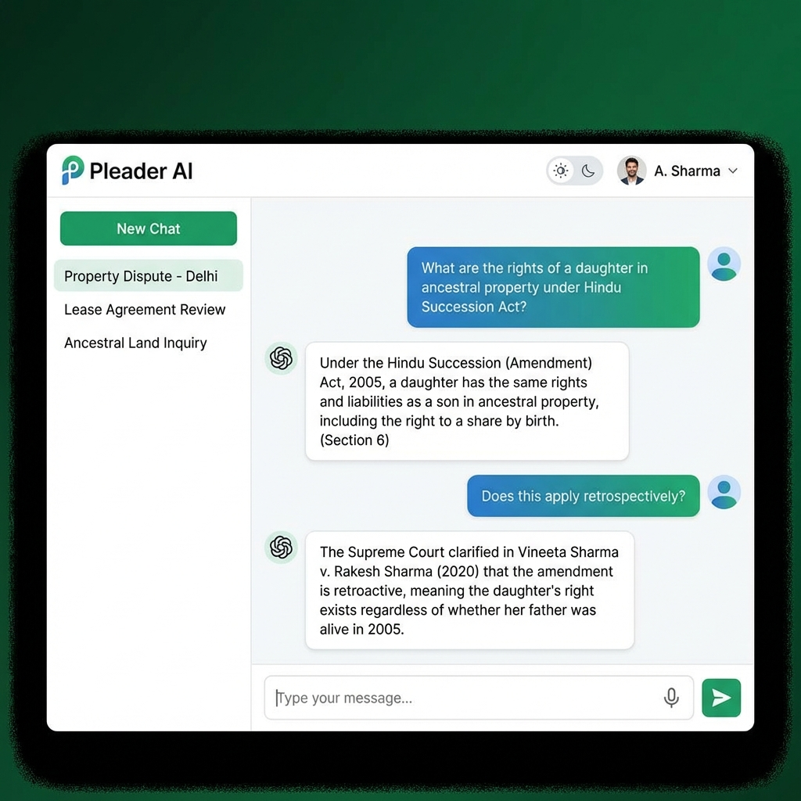
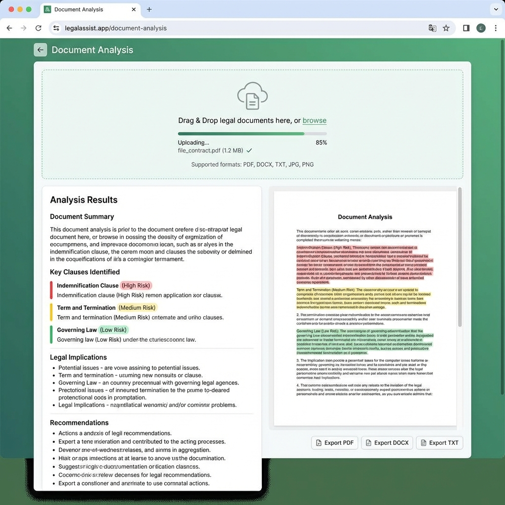
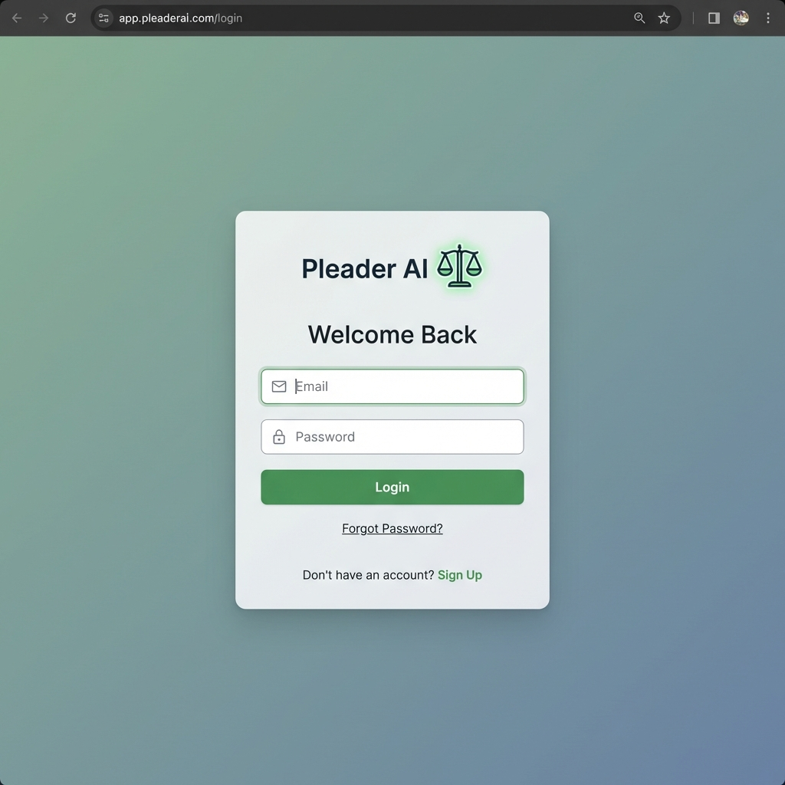
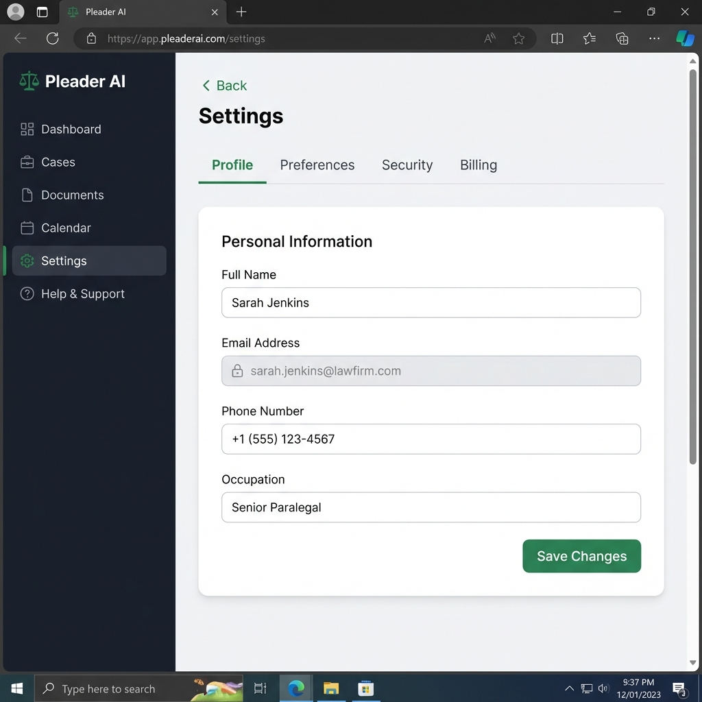
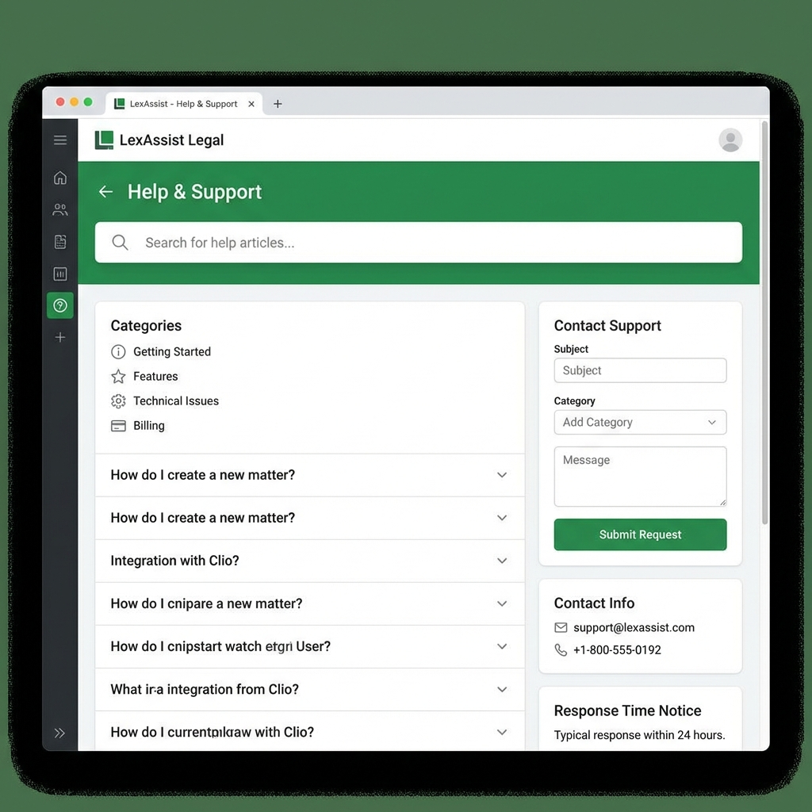

# 🏛️ Pleader AI - Legal Assistant Application

> **Production-ready AI-powered legal assistant for Indian law**

Pleader AI is a comprehensive full-stack legal assistance platform that combines **RAG (Retrieval-Augmented Generation)** with Google's **Gemini AI** to provide accurate, document-grounded legal advice focused exclusively on Indian law.

---

## 📸 Application Screenshots

### Landing Page

*Modern, professional landing page with feature highlights and call-to-action buttons*

### AI Chat Dashboard

*ChatGPT-style interface with conversation history, voice input, and theme switching*

### Document Analysis

*Upload legal documents for AI-powered analysis with risk assessment and recommendations*

### Login Page

*Secure authentication with email/password and Google OAuth support*

### Settings Page

*User profile management with preferences, security, and billing tabs*

### Help & Support

*Comprehensive FAQ section and contact support form*

---

## 🌟 Features Overview

### 🔐 Authentication & Security
| Feature | Description |
|---------|-------------|
| JWT Authentication | Secure token-based authentication with 7-day expiration |
| Password Hashing | bcrypt-based password encryption |
| Rate Limiting | Built-in API rate limiting per endpoint |
| CORS Protection | Configurable cross-origin resource sharing |
| Security Headers | XSS, content-type, and frame protection headers |

### 💬 AI Chat System
| Feature | Description |
|---------|-------------|
| Gemini AI Integration | Powered by Google's latest Gemini AI model |
| RAG Pipeline | Document-grounded responses using FAISS vector store |
| Conversation History | Persistent chat history with search capability |
| Voice Input | Web Speech API integration for hands-free typing |
| Message Export | Export conversations as PDF, DOCX, or TXT |
| Indian Law Focus | All responses strictly based on Indian legal framework |

### 📄 Document Analysis
| Feature | Description |
|---------|-------------|
| Multi-format Support | PDF, DOCX, TXT, JPG, PNG with OCR |
| Text Extraction | Intelligent text extraction from all supported formats |
| Legal Analysis | AI-powered clause identification and risk assessment |
| Risk Categorization | Color-coded risk levels (Low, Medium, High) |
| Recommendations | Actionable legal recommendations |
| Export Analysis | Download analysis reports in multiple formats |

### 🔍 RAG (Retrieval-Augmented Generation)
| Feature | Description |
|---------|-------------|
| FAISS Vector Store | High-performance similarity search |
| Gemini Embeddings | State-of-the-art text embeddings |
| Document Chunking | Intelligent text chunking with overlap |
| Re-ranking | Optional result re-ranking for better relevance |
| Index Statistics | Monitor indexed documents and chunks |

### 🎨 User Interface
| Feature | Description |
|---------|-------------|
| 6 Color Themes | Green, Blue, Purple, Orange, Pink, Gray |
| Responsive Design | Mobile, tablet, and desktop support |
| Dark Mode Ready | Theme infrastructure for dark mode |
| Animations | Smooth transitions and loading states |
| Toast Notifications | User feedback with sonner toasts |

---

## 🏗️ Technical Architecture

```
┌─────────────────────────────────────────────────────────────────┐
│                        FRONTEND (React)                         │
│  ┌─────────────┐ ┌─────────────┐ ┌─────────────┐ ┌───────────┐ │
│  │   Landing   │ │  Dashboard  │ │  Document   │ │ Settings  │ │
│  │    Page     │ │   (Chat)    │ │  Analysis   │ │   Page    │ │
│  └─────────────┘ └─────────────┘ └─────────────┘ └───────────┘ │
│  ┌─────────────────────────────────────────────────────────────┐│
│  │                Component Library (shadcn/ui)                ││
│  │  Button, Input, Tabs, Accordion, Dialog, Dropdown, etc.    ││
│  └─────────────────────────────────────────────────────────────┘│
│  ┌─────────────────────────────────────────────────────────────┐│
│  │              Context Providers                              ││
│  │  AuthContext (auth state) + ThemeContext (6 color themes)  ││
│  └─────────────────────────────────────────────────────────────┘│
└─────────────────────────────────────────────────────────────────┘
                              │ HTTP/REST
                              ▼
┌─────────────────────────────────────────────────────────────────┐
│                       BACKEND (FastAPI)                         │
│  ┌─────────────┐ ┌─────────────┐ ┌─────────────┐ ┌───────────┐ │
│  │  Auth API   │ │  Chat API   │ │ Document API│ │  RAG API  │ │
│  │  /api/auth  │ │  /api/chat  │ │ /api/docs   │ │ /api/rag  │ │
│  └─────────────┘ └─────────────┘ └─────────────┘ └───────────┘ │
│  ┌─────────────────────────────────────────────────────────────┐│
│  │                    Middleware Layer                         ││
│  │  Rate Limiting + Security Headers + Request Logging        ││
│  └─────────────────────────────────────────────────────────────┘│
│  ┌─────────────────────────────────────────────────────────────┐│
│  │                    Utility Modules                          ││
│  │  document_utils.py │ rag_utils.py │ export_utils.py        ││
│  └─────────────────────────────────────────────────────────────┘│
└─────────────────────────────────────────────────────────────────┘
                              │
          ┌───────────────────┼───────────────────┐
          ▼                   ▼                   ▼
   ┌─────────────┐    ┌─────────────┐    ┌─────────────┐
   │   MongoDB   │    │  FAISS      │    │  Gemini AI  │
   │  (Storage)  │    │  (Vectors)  │    │   (LLM)     │
   └─────────────┘    └─────────────┘    └─────────────┘
```

---

## 📁 Project Structure

```
pleader.io/
├── backend/
│   ├── server.py           # Main FastAPI application (820+ lines)
│   ├── config.py           # Environment configuration
│   ├── middleware.py       # Rate limiting, security headers, logging
│   ├── document_utils.py   # PDF, DOCX, TXT, Image text extraction
│   ├── rag_utils.py        # FAISS indexing, Gemini embeddings, RAG pipeline
│   ├── export_utils.py     # PDF, DOCX, TXT export generation
│   ├── requirements.txt    # Python dependencies
│   ├── Dockerfile          # Container configuration
│   └── .env.example        # Environment variables template
│
├── frontend/
│   ├── src/
│   │   ├── pages/
│   │   │   ├── Landing.js       # Public landing page
│   │   │   ├── Login.js         # Authentication page
│   │   │   ├── Signup.js        # Registration page
│   │   │   ├── Dashboard.js     # Main chat interface
│   │   │   ├── DocumentAnalysis.js  # Document upload & analysis
│   │   │   ├── Settings.js      # User preferences
│   │   │   └── Help.js          # FAQ & support
│   │   │
│   │   ├── components/
│   │   │   ├── ui/              # shadcn/ui components (46 files)
│   │   │   ├── ThemeSwitcher.js # Theme selection component
│   │   │   └── VoiceInput.js    # Voice transcription component
│   │   │
│   │   ├── context/
│   │   │   ├── AuthContext.js   # Authentication state
│   │   │   └── ThemeContext.js  # Theme state with 6 presets
│   │   │
│   │   ├── utils/
│   │   │   └── api.js           # API client functions
│   │   │
│   │   ├── App.js               # Main app with routing
│   │   └── index.js             # Entry point
│   │
│   ├── public/
│   │   └── index.html           # HTML template
│   │
│   ├── package.json             # Node dependencies
│   └── tailwind.config.js       # Tailwind CSS configuration
│
├── docs/
│   └── screenshots/             # Application screenshots
│
├── README.md                    # This file
├── DEPLOY.md                    # Deployment guide
├── AUDIT.md                     # Change log
└── TODO.md                      # Development roadmap
```

---

## 🚀 Quick Start

### Prerequisites

- **Python 3.11+** - Backend runtime
- **Node.js 18+ & Yarn** - Frontend build tools
- **MongoDB** - Database (local or MongoDB Atlas)
- **Gemini API Key** - [Get one here](https://makersuite.google.com/app/apikey)

### Step 1: Clone Repository

```bash
git clone https://github.com/ashokkumarboya93/Pleader.ai.git
cd Pleader.ai
```

### Step 2: Backend Setup

```bash
cd backend

# Install Python dependencies
pip install -r requirements.txt

# Configure environment
cp .env.example .env
# Edit .env with your credentials (see Environment Variables section)

# Run backend server
python -m uvicorn server:app --host 127.0.0.1 --port 8000 --reload
```

### Step 3: Frontend Setup

```bash
cd frontend

# Install Node dependencies
yarn install

# Configure environment
cp .env.example .env
# Edit .env with backend URL

# Run frontend development server
yarn start
```

### Step 4: Access Application

- **Frontend**: http://localhost:3000
- **Backend API**: http://localhost:8000
- **API Documentation**: http://localhost:8000/docs

---

## ⚙️ Environment Variables

### Backend (`backend/.env`)

```env
# MongoDB Connection
MONGO_URL=mongodb://localhost:27017
DB_NAME=pleader_ai_db

# Gemini AI API Key
GEMINI_API_KEY=your_gemini_api_key_here

# JWT Secret for Authentication
JWT_SECRET=your_jwt_secret_key_here_make_it_very_long_and_random

# CORS Origins
CORS_ORIGINS=http://localhost:3000

# File Upload Settings
MAX_FILE_SIZE=31457280  # 30MB

# Rate Limiting (requests per minute)
RATE_LIMIT_RAG=10
RATE_LIMIT_CHAT=20
RATE_LIMIT_UPLOAD=5

# Environment
ENVIRONMENT=development
```

### Frontend (`frontend/.env`)

```env
# Backend API URL
REACT_APP_BACKEND_URL=http://localhost:8000

# WebSocket Port (for hot reload)
WDS_SOCKET_PORT=443
```

---

## 🔌 API Endpoints

### Authentication
| Method | Endpoint | Description |
|--------|----------|-------------|
| POST | `/api/auth/signup` | Register new user |
| POST | `/api/auth/login` | Login user |
| POST | `/api/auth/logout` | Logout user |
| GET | `/api/auth/me` | Get current user |
| POST | `/api/auth/session` | OAuth session creation |

### Chat
| Method | Endpoint | Description |
|--------|----------|-------------|
| POST | `/api/chat/send` | Send message & get AI response |
| GET | `/api/chat/history` | Get all user chats |
| GET | `/api/chat/{id}` | Get specific chat |
| DELETE | `/api/chat/{id}` | Delete chat |
| GET | `/api/chat/{id}/export/{format}` | Export chat (pdf/docx/txt) |

### Documents
| Method | Endpoint | Description |
|--------|----------|-------------|
| POST | `/api/documents/analyze` | Upload & analyze document |
| GET | `/api/documents` | Get user's documents |
| DELETE | `/api/documents/{id}` | Delete document |
| GET | `/api/documents/{id}/export/{format}` | Export analysis |

### RAG
| Method | Endpoint | Description |
|--------|----------|-------------|
| POST | `/api/rag/query` | Query RAG pipeline |
| GET | `/api/rag/stats` | Get index statistics |

### System
| Method | Endpoint | Description |
|--------|----------|-------------|
| GET | `/api/health` | Health check with version info |

---

## 🧪 Testing

### Backend Tests

```bash
cd backend

# Run all tests
pytest

# Run with coverage
pytest --cov=. --cov-report=html

# Run specific test file
pytest test_api.py -v
```

### Demo Credentials

For testing purposes (run `python create_test_accounts.py` first):
- **Email**: `john@test.com`
- **Password**: `password123`

Or:
- **Email**: `jane@test.com`
- **Password**: `password123`

---

## 🚢 Deployment

### Quick Deploy Options

| Platform | Frontend | Backend | Database |
|----------|----------|---------|----------|
| Vercel | ✅ | ❌ | ❌ |
| Railway | ✅ | ✅ | ✅ |
| Render | ✅ | ✅ | ❌ |
| MongoDB Atlas | ❌ | ❌ | ✅ |

See detailed deployment guide in [DEPLOY.md](./DEPLOY.md)

---

## 🔒 Security Features

- **JWT Authentication** - Secure token-based auth with 7-day expiration
- **Bcrypt Password Hashing** - Industry-standard password encryption
- **Rate Limiting** - Per-endpoint request limiting
- **File Size Limits** - 30MB maximum upload size
- **CORS Configuration** - Configurable allowed origins
- **Security Headers** - XSS protection, content-type sniffing prevention
- **Request Logging** - Full request/response logging

---

## 🎨 Theme System

Pleader AI includes 6 pre-configured color themes:

| Theme | Primary Color | Use Case |
|-------|---------------|----------|
| 🟢 Green | `#4ADE80` | Default - Legal/Professional |
| 🔵 Blue | `#60A5FA` | Corporate/Trust |
| 🟣 Purple | `#C084FC` | Creative/Modern |
| 🟠 Orange | `#FB923C` | Warm/Energetic |
| 🌸 Pink | `#F472B6` | Friendly/Approachable |
| ⚪ Gray | `#9CA3AF` | Minimal/Neutral |

---

## 📊 Supported Document Types

| Type | Extensions | Extraction Method |
|------|------------|-------------------|
| PDF | `.pdf` | pypdf |
| Word | `.docx` | python-docx |
| Text | `.txt`, `.text` | UTF-8/Latin-1 decode |
| Images | `.jpg`, `.jpeg`, `.png`, `.bmp`, `.tiff` | Tesseract OCR |

---

## 🛠️ Technology Stack

### Backend
- **FastAPI** - Modern Python web framework
- **MongoDB** - Document database
- **FAISS** - Vector similarity search
- **Google Gemini** - AI/LLM provider
- **PyJWT** - JWT authentication
- **bcrypt** - Password hashing
- **python-docx** - DOCX processing
- **pypdf** - PDF processing
- **Tesseract/pytesseract** - OCR

### Frontend
- **React 19** - UI framework
- **React Router v7** - Client-side routing
- **Tailwind CSS v3** - Utility-first CSS
- **shadcn/ui** - Component library
- **Axios** - HTTP client
- **Sonner** - Toast notifications
- **Lucide React** - Icon library

---

## 📞 Support

For issues and feature requests:
- **Email**: support@pleaderai.com
- **GitHub Issues**: [Create an issue](https://github.com/ashokkumarboya93/Pleader.ai/issues)

---

## 📄 License

This project is proprietary software. All rights reserved.

---

**Built with ❤️ for the Indian legal community**
